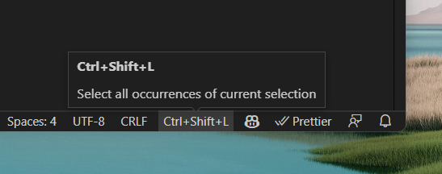
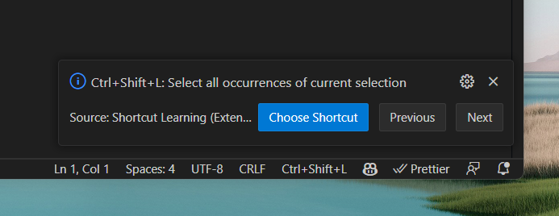
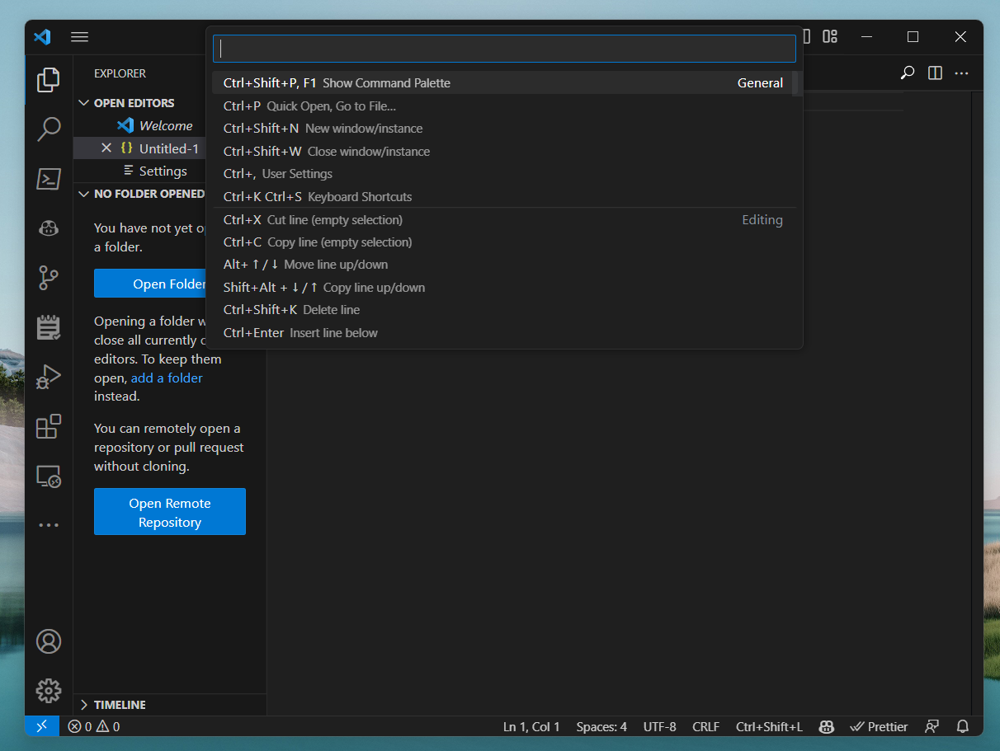

## Shortcut Learning

An extension to (slowly) but truly learn about vscode shortcuts.

VS Code has a lot of shortcuts. This extension aims to help you learn more of them *one at a time*. Often times I discover a new shortcut and forget it a few days later. This extension adds the shortcut to the status bar so that you can glance down and see it. I figure that if I see it every time I open VS Code, I'll remember it.

The shortcuts used in this extension were found from the [VS Code documentation](https://code.visualstudio.com/shortcuts/learn-keyboard-shortcuts-windows.pdf).

Note - Currently only has shortcuts for Windows

### Status bar 
In the bottom corner you will see the current shortcut. Hovering over it will show you the shortcut and the description.

### More information 
Clicking on the status bar item lets you see more information about the shortcut. It also lets you choose a new shortcut to learn.

### Choosing a category of shortcuts
I personally want to get better at keyboard shortcuts for editing. So I can choose that category and only see shortcuts for editing.

